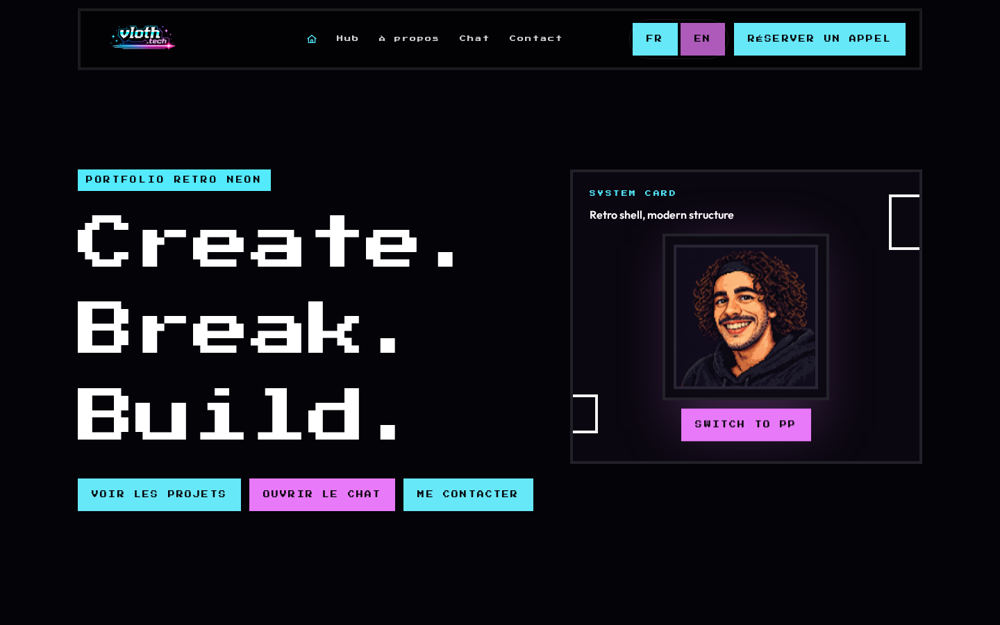
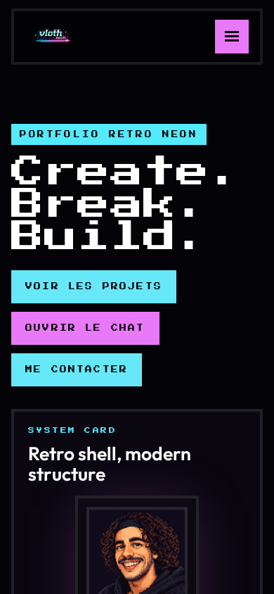
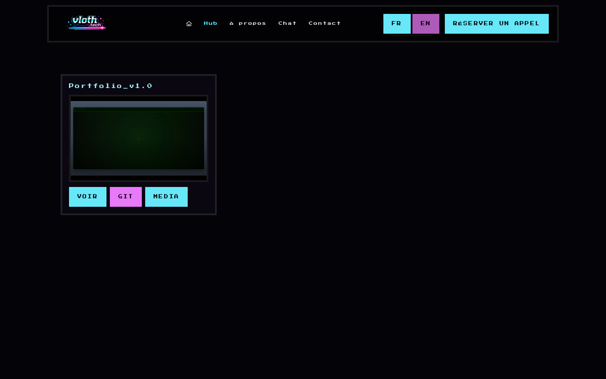

# ChatBot-Portefolio

Portfolio retro pixel avec frontend React, CMS Strapi, PostgreSQL et chatbot FastAPI/Groq. Le projet est pensé pour tourner proprement en local avec Docker Compose, avec un contenu de projets piloté par Strapi et un assistant RAG optionnel.



## Apercu





## Stack

- `frontend/` : React, Vite, Tailwind CSS, React Router
- `cms/strapi/` : Strapi v5 pour administrer les projets
- `postgres` : base PostgreSQL pour Strapi
- `backend/` : FastAPI pour le chatbot
- `kb/` : base de connaissance locale du chatbot, volontairement non versionnee
- `docker-compose.yml` : orchestration locale

## Fonctionnalites

- Portfolio responsive avec direction retro neon pixel
- Header desktop et menu burger mobile
- Theming cyan/rose harmonise sur boutons, panels et accents visuels
- Page `Hub` connectee a Strapi pour afficher les projets
- Collection Strapi `Project` avec media image/video, liens GitHub/projet, description et date
- Chatbot FastAPI/Groq avec recuperation RAG via FAISS
- Stack Docker separee : frontend, backend, Strapi, PostgreSQL

## Demarrage rapide

Copier les variables d'environnement :

```bash
cp .env.example .env
```

Lancer le frontend + CMS :

```bash
make up-front-cms
```

Ouvrir :

- site : `http://localhost:5173`
- Strapi admin : `http://localhost:1337/admin`

Lancer toute la stack, chatbot inclus :

```bash
make up
```

## Commandes utiles

```bash
make up                 # lance tous les services sans rebuild
make up-front-cms       # lance PostgreSQL, Strapi et le frontend
make up-frontend        # lance seulement le frontend
make up-chatbot         # lance seulement le backend chatbot
make up-strapi          # lance Strapi et PostgreSQL
make up-build           # rebuild puis lance tous les services
make build-no-chatbot   # build uniquement les images frontend
make down               # stoppe les services
make logs               # suit les logs
```

## Configuration Strapi

Apres le premier lancement :

1. Ouvrir `http://localhost:1337/admin`
2. Creer le compte administrateur
3. Aller dans `Content Manager` puis `Project`
4. Creer et publier les projets
5. Aller dans `Settings -> Users & Permissions Plugin -> Roles -> Public`
6. Autoriser `find` et `findOne` pour `Project`

L'API utilisee par le frontend :

```text
/cms/projects?populate=media&sort=date:desc
```

En dev, Vite proxy `/cms` vers Strapi `/api`.

## Modele Project

La collection Strapi `Project` contient :

- `name` : nom du projet
- `media` : image ou video
- `git_url` : lien GitHub
- `project_url` : lien public du projet
- `description` : description longue
- `date` : date du projet

Schema :

```text
cms/strapi/src/api/project/content-types/project/schema.json
```

## Chatbot et base de connaissance

Le dossier `kb/` n'est pas versionne pour eviter de publier des informations personnelles. Pour lancer le chatbot, il faut fournir localement une base de connaissance et generer les fichiers FAISS attendus :

```text
kb/kb.index.faiss
kb/kb.index.meta.json
```

Sans ces fichiers, le backend FastAPI peut demarrer en erreur avec `FAISS index not found`.

La route chatbot cote frontend est :

```text
/chat
```

Le proxy API est :

```text
/api/chat
```

## Variables d'environnement

Le fichier `.env` est ignore par Git. Le modele versionne est :

```text
.env.example
```

Il contient les variables pour :

- Groq / chatbot
- RAG / KB
- Strapi
- PostgreSQL

## Developpement frontend direct

```bash
cd frontend
npm install
npm run dev
```

Verification build :

```bash
cd frontend
npm run build
```

## Notes de securite

Ne sont pas pushes dans ce depot :

- `.env`
- `kb/`
- videos locales lourdes
- uploads Strapi
- `node_modules`
- builds et caches

Le depot contient uniquement la configuration, le code applicatif, le schema Strapi, `.env.example` et les captures du README.
